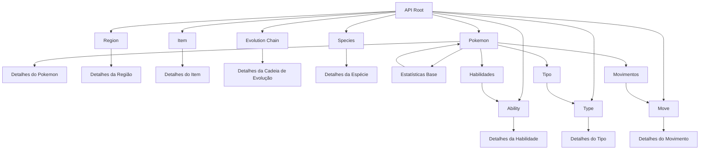
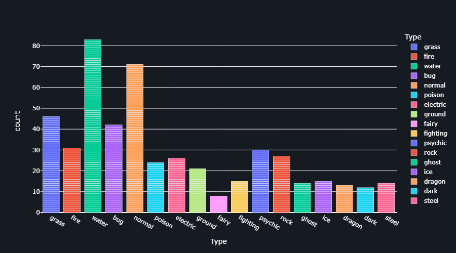
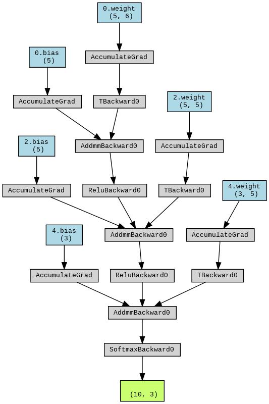

# Analise de dados pokemon.

<div style="width: 20%;">
     
      
    
     
     
</div>

<br>
Esse é um desafio técnico de análise de dados, utilizando a API de Pokémon para extrair informações e realizar análises. O ambiente que eu utilizei para essa aplicação foi em um jupyter notebook no ambiente do <a href="https://colab.google"> Google colab </a>.

<br>

- [Conjunto de dados e API](#conjunto-de-dados-x-api)
- [Visualização](#visualização)
- [Modelo e resultado](#modelo--resultado)

- [Tecnologias](#tecnologias)


## CONJUNTO DE DADOS x API

Os dados foram coletados utilizando a [API de Pokémon](https://pokeapi.co), garantindo que todos os atributos relevantes para a análise fossem incluídos.


<p align='center'> Esᴛʀᴜᴛᴜʀᴀ ᴅᴇ ᴇɴᴅᴘᴏɪɴᴛs ᴅᴀ API</p>

Em relação aos dados utilizados neste projeto, foram extraídos para analise de dados e parametro para modelo de rede neural os seguintes atributos:


|  ID | NAME | TYPE| HEIGHT| HP | SPEED | ATTACK | DEFENSE | REGION | GENERATION |
| -- | --- | --- |--- |--- |--- |--- |--- |--- |--- |
| 4	| charmander|fire|6|39|65|52|43 |	Kanto	|1


### ID
O ID é um identificador único atribuído a cada Pokémon dentro da base de dados da PokeAPI. Ele serve como um meio de referência direta para cada Pokémon e é essencial para acessar informações detalhadas de cada entrada na API.

### Name
O Name representa o nome do Pokémon. Este atributo é importante para identificar os Pokémon de maneira intuitiva e é utilizado frequentemente em análises e visualizações para tornar os resultados mais compreensíveis e interpretáveis.

### Type
O Type descreve a tipagem elemental do Pokémon, como Água, Fogo, Grama, entre outros. Cada Pokémon pode ter um ou dois tipos. Esse atributo é fundamental na análise, pois o tipo de um Pokémon determina suas fraquezas, resistências e movimentos que pode aprender, influenciando diretamente suas estratégias de batalha.

### Height
O Height refere-se à altura do Pokémon, geralmente medida em metros. Embora não seja um fator crítico para desempenho em batalhas, a altura pode ser relevante para determinadas análises, como correlações com atributos físicos ou estéticos de grupos de Pokémon.

### HP (Health Points)
HP, ou Health Points, representa o total de pontos de vida de um Pokémon. Este atributo é crucial em batalhas, pois determina a quantidade de dano que um Pokémon pode receber antes de ser nocauteado. HP é frequentemente analisado em conjunto com outros atributos para entender a durabilidade de um Pokémon em combate.

### Speed
Speed determina a rapidez com que um Pokémon pode agir durante uma batalha. Um Pokémon com uma alta velocidade frequentemente atacará antes do seu oponente, o que pode ser uma vantagem estratégica significativa. Este atributo é essencial para análises que exploram táticas de combate e prioridades em batalhas.

### Attack
O Attack refere-se ao poder ofensivo de um Pokémon para movimentos físicos. É um dos atributos mais importantes para Pokémon que utilizam ataques físicos, influenciando diretamente a quantidade de dano que seus ataques causam ao oponente. Este atributo é analisado para entender o potencial ofensivo de um Pokémon.

### Defense
Defense é o atributo que determina a capacidade de um Pokémon de resistir a ataques físicos. Quanto maior a defesa, menor será o dano sofrido por ataques físicos. Este atributo é utilizado para avaliar a capacidade defensiva de um Pokémon, especialmente em estratégias que priorizam a durabilidade.

### Region
Region indica a região fictícia no universo Pokémon de onde o Pokémon é originário, como Kanto, Johto, Hoenn, etc. Este atributo pode ser útil para análises que exploram a distribuição geográfica dos Pokémon e as características típicas de cada região, como tipos predominantes ou estratégias de batalha comuns.

### Generation
Generation refere-se à geração de jogos Pokémon em que o Pokémon foi introduzido. Esse atributo é importante para entender a evolução do design e das mecânicas do jogo ao longo do tempo, bem como para análises históricas ou comparativas entre gerações diferentes.


```python
charmander = pb.pokemon('charmander')
print(charmander.name)
print(charmander.types[0].type)
print(charmander.height)

for status in charmander.stats:
  print(f"{status.stat.name}: {status.base_stat}")
```


### Resposta:
```
charmander
fire
6
hp: 39
attack: 52
defense: 43
special-attack: 60
special-defense: 50
speed: 65
```

## Visualização.
### Visualização dos types dentro da base de dados.

```Python
bar_visualization = px.bar(df.Type, x="Type", color='Type', barmode='stack')
bar_visualization.update_layout(
    plot_bgcolor='#161b22',
    paper_bgcolor='#161b22',
    font_color='white',
    title_font_color='white',
    xaxis_title_font_color='white',
    yaxis_title_font_color='white',
    width=900,
    height=500)
```
<p align="center">

</p>


### Visualização das médias por atributo para cada type.

```Python
graph = px.box(df, x=ATRIBUTO, y='Type',points='all', title="Attack Pokemons - Median", color="Type")
graph.update_layout(
    plot_bgcolor='#161b22',
    paper_bgcolor='#161b22',
    font_color='white',
    title_font_color='white',
    xaxis_title_font_color='white',
    yaxis_title_font_color='white',
    width=900,
    height=500)
graph
```
<p align='center'>
<div >
    
     <br>
    
    

</div>
</p>

### Visualização de correlação.
```python
graph = px.scatter_matrix(df, dimensions=["Attack","Defense", "HP", "Speed"], color="Type")
graph.update_layout(
    plot_bgcolor='#161b22',
    paper_bgcolor='#161b22',
    font_color='white',
    title_font_color='white',
    xaxis_title_font_color='white',
    yaxis_title_font_color='white',
    width=900,
    height=500)
graph.show() 
```
<p align="center">

</p>

### Visualização de tamanho do ataque a partir de pokemon na região.

```python
fig = px.scatter(Kanto, y="Attack", trendline="ols", facet_col_wrap=17, color='Type')


# Ajusta o espaçamento entre os subplots
fig.update_xaxes(matches=None)
fig.update_yaxes(matches=None)
fig.update_layout(
    plot_bgcolor='#161b22',
    paper_bgcolor='#161b22',
    font_color='white',
    title_font_color='white',
    xaxis_title_font_color='white',
    yaxis_title_font_color='white',
    width=900,
    height=500)
fig.show()
```

<p align="center">

</p>


### Visualiação de numero de pokemons por região

```python
bar_visualization = px.bar(df, x="Region", color='Region', barmode='stack', title="Number of pokemon by region")
bar_visualization.update_layout(
    plot_bgcolor='#161b22',
    paper_bgcolor='#161b22',
    font_color='white',
    title_font_color='white',
    xaxis_title_font_color='white',
    yaxis_title_font_color='white',
    width=900,
    height=500)
bar_visualization
```

<p align="center">

</p>


### Visualização de tipos de pokemon por região

```python
df_exploded = df.explode('Type')
type_counts = df_exploded.groupby(['Region', 'Type']).size().reset_index(name='Count')

# Criar o gráfico de barras slide.
fig = px.bar(type_counts, x='Type', y='Count', color='Type',
             animation_frame='Region', animation_group='Type',
             range_y=[0, type_counts['Count'].max()],
             title="Amount type of pokemon by region")
fig.update_layout(
    plot_bgcolor='#161b22',
    paper_bgcolor='#161b22',
    font_color='white',
    title_font_color='white',
    xaxis_title_font_color='white',
    yaxis_title_font_color='white',
    width=900,
    height=500)
fig.show()
```

<p align='center'>
<div >
    
     <br>
    
    

</div>
</p>


## Modelo & Resultado.

```python
classificador = nn.Sequential(
    nn.Linear(6, 5, bias=True),
    nn.ReLU(),
    nn.Linear(5, 5, bias=True),
    nn.ReLU(),
    nn.Linear(5, 3, bias=True),
    )
```
<p align="center">

</p>


### Resultado;
<p align="center">

</p>


## Tecnologias.

- Python
- Plotly
- Pytorch
- Pandas
- Numpy
- sklearn

<br>
<h>
<p align='center'>
<div style="width: 50%; height: 2px; display: flex; justify-content: center; align-items: center; margin: 0 auto;">
    <a href="https://github.com/ViniciusSilveiraCampos" target="_blank"></a>
    <a href="https://www.linkedin.com/in/vinicius-silveira-campos/" target="_blank"></a> 
    <a href="mailto:vinicius.silveira.campos@gmail.com" target="_blank"></a>
</div>
</p>